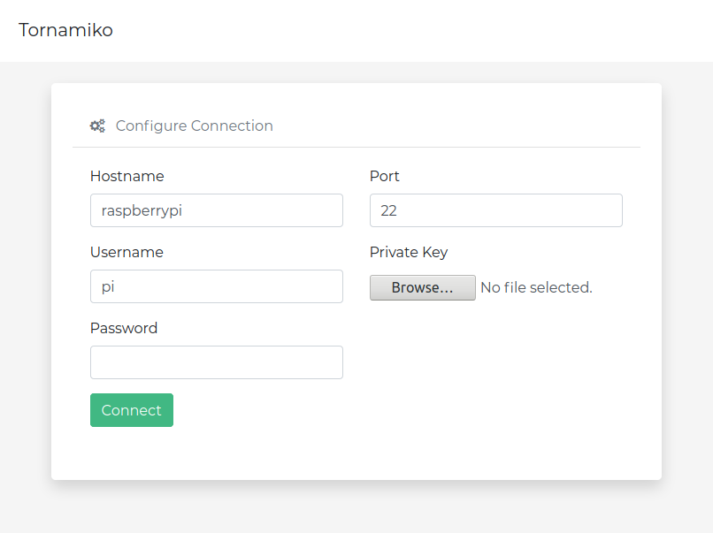

# Web SSH client.

## Installation

(Optional) Create virtual environment

Install dependencies

```sh
$ pip install -r requirements.txt
```

```sh
$ npm install
```

Build

```sh
$ npm run build
```

## Run

```sh
$ python manage.py run
```

## Screenshots




