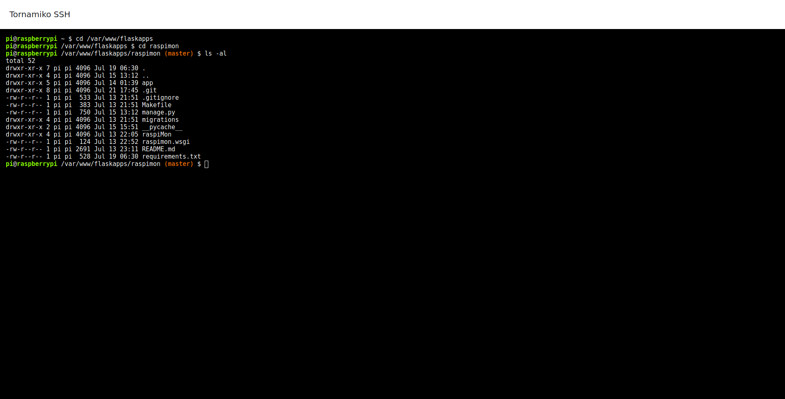

# Web-based SSH client.

## Installation

Install dependencies:

```sh
$ pip install -r requirements.txt
```

```sh
$ npm install
```


Build assets:

```sh
$ npm run build
```


## Run

```sh
$ python main.py
```

## Screenshot




