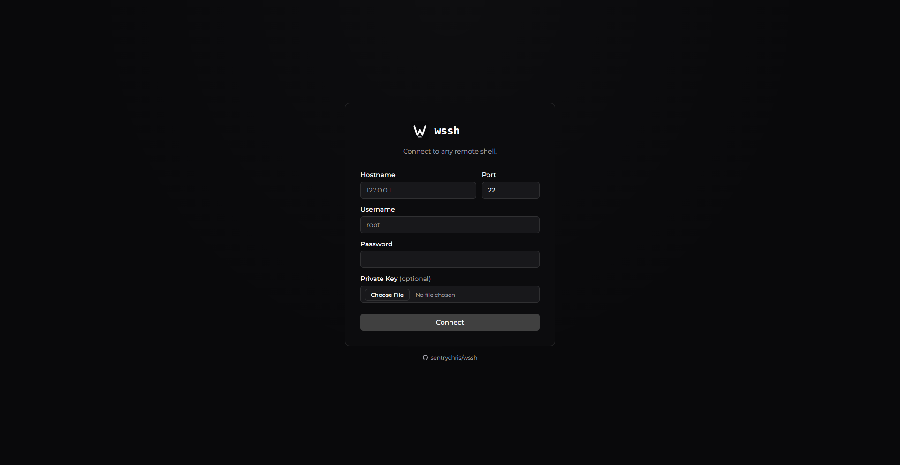
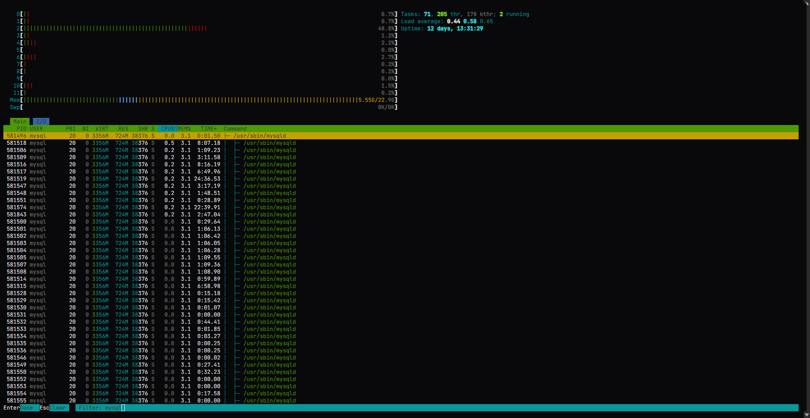

<p align="center">
  
</p>

A small and simple web-based SSH client. Built with [Paramiko](https://www.paramiko.org/), [Tornado](https://www.tornadoweb.org/en/stable/), [XtermJS](https://xtermjs.org/) and [Alpine.js](https://alpinejs.dev/).

<p align="center">
  
  
</p>

## Trust & Security

> [!WARNING]
> Be warned. Web-based SSH is a credential-harvesting nightmare by design.

wssh is designed to run on infrastructure **you control**. When you upload a
private key it's parsed in memory and held only for the duration of the SSH
session, it's never written to disk, never re-transmitted, and never logged. When
the session closes, the key is released to the garbage collector.

That said, you should treat any hosted instance the same way you'd treat any
SSH gateway: anyone with shell on the box can dump process memory or modify
the source. **Don't paste production keys into a wssh instance you don't
operate yourself.** For sensitive use, deploy your own copy from this
repository and make sure `'debug'` is set to `False` in `ssh.py`
before exposing it to the network.

Read [./docs/deployment-guide.md](./docs/deployment-guide.md) if you want to host
your own instance.

## Installation

Requires Python >= 3.10. Uses the stdlib `venv` module and `pip`; no extra
tooling needed.

Clone the repository and create your venv:
```sh
$ git clone https://github.com/sentrychris/ssh-client.git
$ cd ssh-client
$ python -m venv .venv
```

Install Python dependencies:
```sh
$ pip install .
```

Install NPM dependencies:
```sh
$ npm install
```

Build:
```sh
$ npm run build
```

Run:
```sh
$ python ssh.py --address=0.0.0.0 --port=4500
```

## Mock SSH

There is a tiny mock SSH server for UI testing available at [`mock_sshd.py`](./mock_sshd.py). It listens on `127.0.0.1:2222`, accepts any username/password, and bridges each session to a real local `/bin/bash`.

Run it:
```sh
$ .venv/bin/python /tmp/mock_sshd.py
```

Then connect from the web UI:
- Hostname: 127.0.0.1
- Port:     2222
-  Username: <anything>
- Password: <anything>